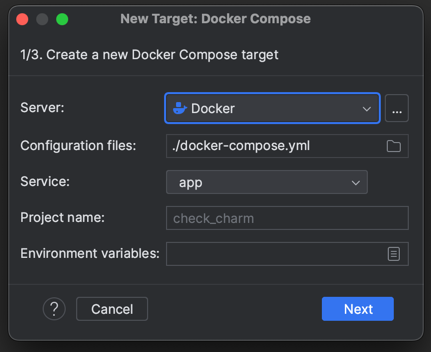
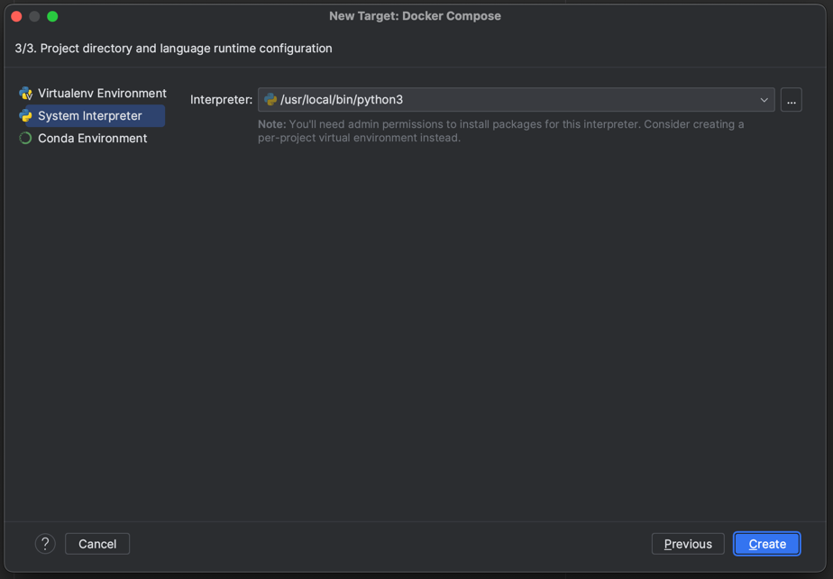
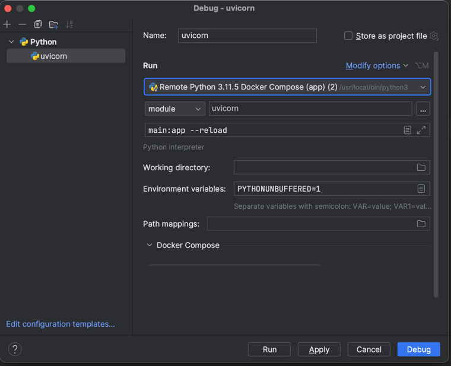

# Reproduce PyCharm bug with debugging uvicorn in PYTHONDEVMODE

## Steps to reproduce

1. `docker compose build`
2. Create docker compose interpreter
   1. 
   2. 
3. Create run configuration
   1. set [module] uvicorn
   2. set parameters `main:app --reload`
   3. 
   4. run Debug
4. See error in console:

```
INFO:     Will watch for changes in these directories: ['/opt/project']
INFO:     Uvicorn running on http://127.0.0.1:8000 (Press CTRL+C to quit)
INFO:     Started reloader process [1] using StatReload
unknown option --port
usage: /usr/local/bin/python3 [option] ... [-c cmd | -m mod | file | -] [arg] ...
Try `python -h' for more information.
unknown option --port
usage: /usr/local/bin/python3 [option] ... [-c cmd | -m mod | file | -] [arg] ...
Try `python -h' for more information.
```

NOTE: If you remove line `ENV PYTHONDEVMODE=1` in Dockerfile and rebuild image, then everything works fine.
